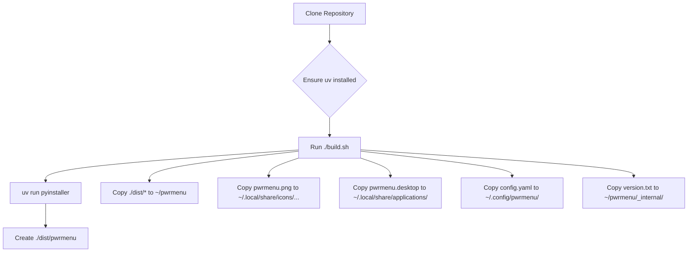

# pwrmenu

A simple, modern power menu application built with PyQt6.

*(Add a screenshot/GIF here)*

## Features

*   Provides Shutdown, Reboot, and Logoff actions.
*   Configurable icons (using [QtAwesome](https://github.com/spyder-ide/qtawesome) font identifiers) and colors.
*   Configurable commands for each action.
*   Keyboard navigation (Left/Right arrows, Enter, Escape).
*   Uses `config.yaml` for settings (default: `~/.config/pwrmenu/config.yaml`).
*   Standalone executable build using PyInstaller.

## Requirements

*   Python >= 3.13
*   [uv](https://github.com/astral-sh/uv) (for dependency management and running build script)
*   Project dependencies (automatically installed via `uv`): PyQt6, qtawesome, confz, etc. (see `pyproject.toml`)
*   Icon fonts required by your chosen icons in `config.yaml` installed system-wide (e.g., Font Awesome 6 Solid, Remix Icon for the default configuration).

## Installation (Using Build Script)

1.  **Clone the repository:**
    ```bash
    git clone https://github.com/your-username/pwrmenu.git # Replace with actual URL
    cd pwrmenu
    ```
2.  **Ensure `uv` is installed:**
    If you don't have `uv`, install it (e.g., `pip install uv` or follow official instructions).
3.  **Run the build and installation script:**
    ```bash
    ./build.sh
    ```

**What the script does:**

The `build.sh` script automates the build and installation process:

*   It uses `uv run pyinstaller` to bundle the Python application into a single executable.
*   Copies the built application (`pwrmenu`) to `~/pwrmenu/`.
*   Copies the application icon (`pwrmenu.png`) to `~/.local/share/icons/hicolor/64x64/apps/`.
*   Copies the desktop entry file (`pwrmenu.desktop`) to `~/.local/share/applications/`, making it available in your application launcher.
*   Copies the default configuration file (`config.yaml`) to `~/.config/pwrmenu/`.
*   Copies the version information (`version.txt`) into the application's internal directory (`~/pwrmenu/_internal/`).

**Installation Flow:**



## Usage

*   **From Application Launcher:** Search for "pwrmenu" in your desktop environment's application menu/launcher.
*   **Directly:** Open a terminal and run `~/pwrmenu/pwrmenu`.

**Keyboard Controls:**

*   **Left/Right Arrows:** Navigate between buttons.
*   **Enter:** Activate the currently focused button's action (Shutdown, Reboot, Logoff).
*   **Escape:** Close the power menu window.

## Configuration

Customize `pwrmenu` by editing the configuration file located at: `~/.config/pwrmenu/config.yaml`

**Example `config.yaml`:**

```yaml
# pwr-menu config file

# --- Icons ---
# Uses QtAwesome identifiers (e.g., 'fa6s.power-off' for Font Awesome 6 Solid)
# Ensure the corresponding font is installed on your system.
shutdownIcon: "fa6s.power-off"
rebootIcon: "fa6s.repeat"
logoffIcon: "ri.logout-box-r-fill" # Example using Remix Icon

# Icon size (pixels)
iconSizeW: 120 # width
iconSizeH: 120 # height

# Icon colors (hex codes)
iconColor: "#19e6c0"       # Normal color
iconColorActive: "black"   # Color when button is focused/active (may depend on theme)

# --- Commands ---
# The system commands to execute for each action
shutdownCommand: "poweroff"
rebootCommand: "reboot"
logoffCommand: "hyprctl dispatch exit" # Example for Hyprland session exit

# --- Main Window ---
MainWindow:
  backgrounColor: "#111122" # Background color of the window
```

**Key Options:**

*   `shutdownIcon`, `rebootIcon`, `logoffIcon`: Define the icons using [QtAwesome](https://github.com/spyder-ide/qtawesome) names. Find names in the QtAwesome documentation or gallery.
*   `iconSizeW`, `iconSizeH`: Set the width and height of the icons.
*   `iconColor`, `iconColorActive`: Set the default and active/focused colors for the icons.
*   `shutdownCommand`, `rebootCommand`, `logoffCommand`: Specify the exact shell commands to run for each action. Adjust these based on your system and desktop environment.
*   `MainWindow.backgrounColor`: Sets the background color of the application window.

## Development (Optional)

1.  **Setup Environment:**
    ```bash
    # Clone the repo if you haven't already
    # cd pwrmenu
    uv venv # Create virtual environment
    source .venv/bin/activate # Activate environment (Linux/macOS)
    # .venv\Scripts\activate # Activate environment (Windows)
    uv pip install -e . # Install in editable mode with dependencies
    # Add any development-specific dependencies if needed
    ```
2.  **Run from Source:**
    ```bash
    uv run python main.py
    ```

## License

This project is licensed under the MIT License - see the [LICENSE](LICENSE) file for details.

## Contributing (Optional)

Contributions are welcome! Please feel free to open an issue or submit a pull request.